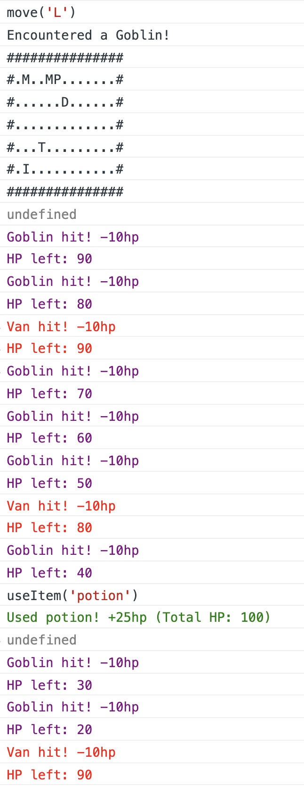

# Javascript project

The goal of this project is to create a console based game in which you are an adventurer on a board game.  
The adventurer can move in 4 directions (Up, Down, Left, Right) and interact with different entities (Monster, Tradesman, Item, Dungeon).

# Game rules

## Entities

Entities are the board game objects that are either simple static elements such as walls & grass or entities like monsters, the tradesman, the player.

All entities have at least 2 properties: a type (string representing entity type) and a position (object representing board position) property.  
These are the different types:

- player
- item
- monster
- tradesman
- dungeon
- grass (symbol is '.')
- wall (symbol is '#')

A position object has 2 properties:

- row: a number representing the index of the board row
- column: a number representing the index of the board column

### Player

The player has the following properties (parentheses has type and initial value)

- name (string)
- level (number - 1)
- items (array of objects - [])
- skills (array of objects - [])
- attack (number - 10)
- speed (number - 2000)
- hp (number - 100)
- gold (number - 0 to start. Can get gold by selling items to the tradesman)
- exp (number - 0 to start. Experience points, increase when slaying monsters)
- type (string - 'player')
- position (object - can be left out and set when needed)
- levelUp (a method to update the level and the different properties affected by a level change. Level up happens when exp >= [player level * 10])

When leveling up, exp must be decreased by the amount used to level up, e.g. exp required to level up = 100. current exp = 120  
-> levelUp is called, incrementing by 1 the level and updating exp to exp = 120 - 100 = 20

### Player level rules

The level of the player impacts certain properties of the player.

- hp: max is level \* 100 (e.g. level 1 -> max is 100hp)
- speed: 4000 / level (as level increases, speed gets smaller and thus faster. Speed is in ms, 0 would be instant attack)
- attack: level \* 10 (increases with level)

### Player skills

Skills have the following properties

- name (string)
- requiredLevel (number - the skill should not be useable if player level is lower)
- cooldown (number - initial value is 0 meaning it's useable, over 0 means we have to wait. This gets updated to the cooldown value when skill is used and gradually decreases until it's back to 0)
- use (function - takes a target / entity as a parameter and uses the skill on it)

2 skills to implement: confuse and steal  
confuse:

- required level is 1
- cooldown is 10000
- use: expects a target as parameter and reverses the name of the target entity as well as dealing [player level \* 25] damage (e.g. level 1 -> deals 25hp)

steal:

- required level is 3
- cooldown is 25000
- use: expects a target as parameter and steals all items of rarity 1 or lower (i.e. unusual or common). Stolen items should be added to the player and removed from the target entity.

### Items

Items have the following properties

- name (string)
- value (number)
- rarity (number - refer to the RARITY_LIST variable)
- use (function - expects a target as parameter to specify on which target to use the item)

2 types of objects to implement:  
potion:

- name: 'potion'
- value: 5
- rarity: 0
- use: restores 25hp to the specified target

bomb:

- name: 'bomb'
- value: 7
- rarity: 0
- use: deals 50hp damage to the specified target

You can tweak the properties and make more item objects

Bonus:  
Potion with rarity 3 restores 100% hp (sets hp back to max hp)  
Bomb with rarity 3 deals 90% damage of hp

### Monsters

Monsters have the following properties (parentheses has type and initial value)

- name (string - random from list of monster names)
- level (number - specified in parameters)
- hp (number - max is level \* 100)
- attack (number - level \* 10)
- speed (number - 6000 / level)
- items (array of objects - may be empty or not depending on parameters)
- position (object - specified in parameters)
- type (string - 'monster')

Monsters give exp (experience points) when defeated following this rule: level \* 10; e.g. level is 2 -> 2 \* 10 = 20 exp points

### Tradesman

Tradesman has the following properties (parentheses has type and initial value)

- name (string - can be anything)
- hp (number - Infinity)
- items (array of objects - may be empty or not depending on parameters)
- position (object - specified in parameters)
- type (string - 'tradesman')

When the player and tradesman have the same position it is possible to buy an item from the tradesman or sell an item. Each item has a value property which is the amount of gold necessary to buy the item. It's also the amount of gold a player receives when selling an item. Higher rarity items should have higher value.

### Dungeon

Dungeon has the following properties (parentheses has type and initial value)

- position (object - specified in parameters)
- type (string - 'dungeon')

### Battle rules

When a player and a monster have the same position, each starts to attack indefinitely at an interval specified by their speed property until either the player moves to a different position or one of the entities hp goes to 0. The damage dealt is specified by the attack property.

## Useful functions

- Math.floor
- Math.random
- setInterval
- setTimeout
- clearInterval
- clearTimeout
- Object.keys
- Object.values

All the array methods

## Notes

Use timestamps to avoid having the web browser collapsing your console output:  
Bad

Good

